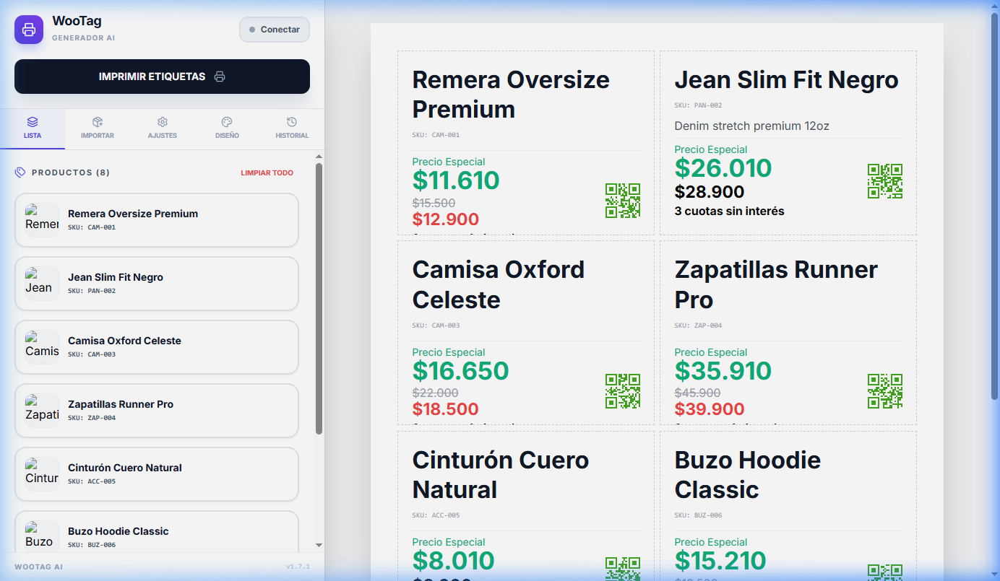
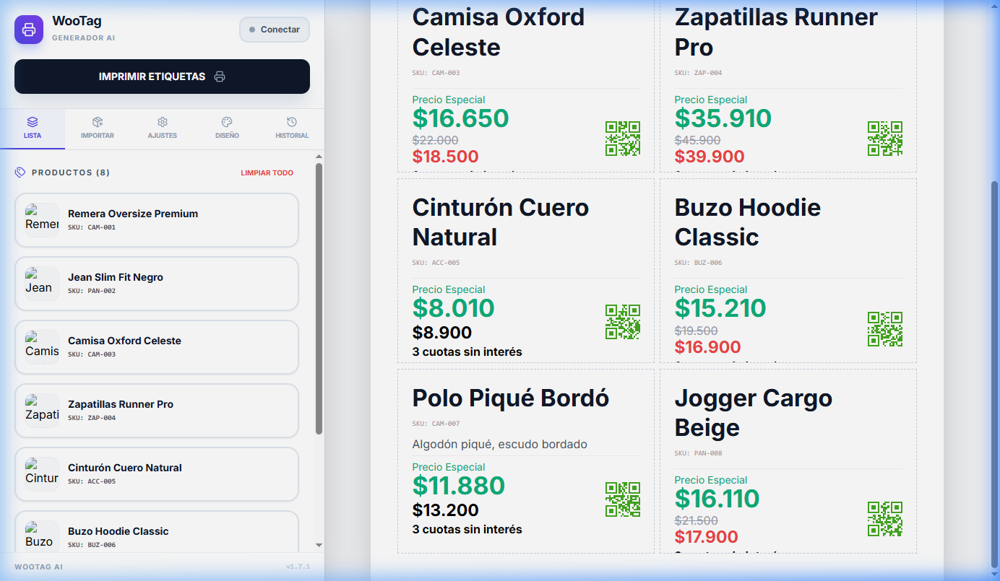

# 🏷️ WooTag AI Generator

**WooTag AI Generator** es una herramienta web para diseñar e imprimir etiquetas de precio profesionales para tiendas WooCommerce. Importa productos desde tu tienda o desde una planilla Excel, personaliza el diseño y genera hojas A4 listas para imprimir, con código QR por producto y optimización de textos vía Google Gemini AI.

Desarrollado con la asistencia de **Antigravity** (Google DeepMind).


---

## 📸 Vista Previa

### Previsualización de Etiquetas



> Panel lateral con 8 productos y hoja A4 con etiquetas mostrando nombre, SKU, precio regular, precio de oferta, precio especial y código QR.

### Segunda Página de Etiquetas



> Scroll en la previsualización mostrando los productos restantes con paginación automática.

---

## 🚀 Características Principales

### ☁️ Cuenta en la Nube (Firebase)

- **Autenticación**: Login, registro y recuperación de contraseña con Firebase Authentication.
- **Sincronización**: Los perfiles de diseño, la configuración de etiqueta y las credenciales de WooCommerce se sincronizan automáticamente en Firestore.
- **Multi-dispositivo**: Los datos se restauran automáticamente al iniciar sesión en cualquier navegador.
- Opcional — la app es completamente funcional sin cuenta.

### 📱 Modo Companion (Emparejamiento por QR)

- **Vincular celular**: El PC genera un QR de sesión única. El celular lo escanea y entra como "Companion".
- **Sincronización en tiempo real**: Todo producto escaneado en el celular aparece instantáneamente en el PC via Firebase Realtime (Firestore).
- Las credenciales de WooCommerce se transfieren a la sesión de manera segura y temporal.

### 🔌 Integración WooCommerce

- **Modo Invitado / Offline**: La app es completamente funcional sin credenciales. Solo se requiere conexión para importar desde la API.
- **Conexión segura**: Credenciales ofuscadas en `localStorage` con salt + base64. La validación prioriza el endpoint de productos para esquivar bloqueos comunes (Error 401).
- **Sesión con expiración**: Las credenciales guardadas expiran a las 24 horas automáticamente.

#### Modal de Conexión


> Formulario para conectar con la API REST de WooCommerce. Acepta URL de la tienda, Consumer Key y Consumer Secret con opción de guardar localmente.

#### Importación de productos — Tab "Importar"

| Método | Descripción |
|--------|-------------|
| **Planilla XLS** | Descarga la plantilla oficial `.xlsx`, completá los datos y subila con drag & drop. Sin necesidad de conexión a la tienda. |
| **Por SKU** | Búsqueda exacta por código. Filtra solo productos publicados (`status=publish`). |
| **Por nombre** | Autocompletado en tiempo real (debounce 400ms) con imagen, nombre y SKU en dropdown. |
| **Por categoría** | Selector con paginación automática — obtiene **todas** las categorías, sin límite de 100. |

> Todos los métodos detectan duplicados y preguntan antes de agregar etiquetas repetidas.


---

### 📊 Importación XLS Segura

La planilla Excel oficial incluye las columnas `sku`, `name`, `price`, `sale_price`, `description`, `category`, `image_url`. El módulo aplica:

- Solo acepta `.xlsx` y `.xls`. Los archivos `.xlsm` (con macros VBA) son **rechazados**.
- Límite de **5 MB** por archivo y **500 filas** por importación.
- SheetJS con `{ cellFormula: false, cellHTML: false, bookVBA: false }` — no ejecuta fórmulas ni macros.
- Sanitización de celdas: solo `string` y `number`.
- URLs de imagen validadas: solo `http:` / `https:`. Se rechazan `javascript:`, `data:`, `file:`.

---

### 🎨 Personalización de Diseño

El panel lateral está organizado en **5 pestañas**:

| Tab | Contenido |
|-----|-----------|
| **Lista** | Lista de productos a imprimir. Botón de acceso rápido a "Importar" cuando está vacía. |
| **Importar** | Importación por XLS + API WooCommerce (SKU / Nombre / Categoría). |
| **Ajustes** | Layout A4 (filas/columnas), visibilidad de campos, Precio Especial, Leyenda de Precio. |
| **Diseño** | Perfiles de diseño guardados (guardar/cargar/eliminar/exportar/importar como JSON). |
| **Historial** | Registro de impresiones con filtro por SKU/nombre. |

#### Campos configurables por etiqueta:
- Distribución: filas × columnas en A4 (ej: 4×2, 5×3, 2×1)
- Visibilidad: nombre, SKU, imagen, descripción, QR, precio oferta, bordes, decimales, separador de miles
- **Precio Especial**: porcentaje configurable (+/-), base (regular/oferta), posición, etiqueta personalizada
- **Leyenda de Precio**: texto libre con color y tamaño independientes
- Formato: `Intl.NumberFormat('es-AR')` → `$1.234,56`

---

### 🧠 Inteligencia Artificial (Gemini AI)

- **Optimización de descripciones**: Convierte textos largos en frases de venta concisas (≤ 15 palabras).
- Modelo: `gemini-2.0-flash` (estable).
- Requiere `GEMINI_API_KEY` en `.env`. Si no está configurada, retorna silenciosamente la descripción original.

---

### 🖨️ Impresión

- Hoja A4 limpia (sin interfaz) con estilos CSS `@media print`.
- Múltiples páginas con paginación automática.
- **Indicador de páginas flotante**: badge animado actualizado en tiempo real al scrollear.
- Historial de impresiones persistido en `localStorage` con deduplicación visual por SKU (`×N`).

---

## 🛠️ Instalación y Uso

### Requisitos

- Node.js v18+
- npm
- Credenciales de la API REST de WooCommerce (Consumer Key + Consumer Secret)
- (Opcional) `GEMINI_API_KEY` para la optimización AI
- (Opcional) Proyecto Firebase para autenticación y sincronización en la nube

### Pasos

```bash
# 1. Clonar el repositorio
git clone <url-del-repo>
cd WooTag

# 2. Instalar dependencias
npm install

# 3. Configurar variables de entorno
# Copiar .env.example a .env y completar los valores
cp .env.example .env

# 4. Iniciar en desarrollo
npm run dev
```

Abre `http://localhost:3000`. La app funciona en **modo diseño** sin credenciales. Para importar desde WooCommerce, hacé clic en **"Conectar"**. Para activar la nube, hacé clic en el ícono ☁️.

### Variables de Entorno

```env
# Firebase (requerido para autenticación y sincronización en la nube)
VITE_FIREBASE_API_KEY="..."
VITE_FIREBASE_AUTH_DOMAIN="proyecto.firebaseapp.com"
VITE_FIREBASE_PROJECT_ID="proyecto"
VITE_FIREBASE_STORAGE_BUCKET="proyecto.firebasestorage.app"
VITE_FIREBASE_MESSAGING_SENDER_ID="..."
VITE_FIREBASE_APP_ID="..."
VITE_FIREBASE_MEASUREMENTID="G-..."

# Gemini AI (opcional)
GEMINI_API_KEY="..."
```

---

## 🧪 Tests Automatizados

```bash
npm test               # Ejecuta los 97 tests una vez
npm run test:watch     # Modo watch para desarrollo
npm run test:coverage  # Genera reporte de cobertura en /coverage
```

| Archivo | Tests | Cubre |
|---------|-------|-------|
| `utils/xlsImport.test.ts` | 39 | Extensión, tamaño, estructura, columnas, happy paths, advertencias, límite de filas, sanitización de URLs y celdas |
| `services/wooService.test.ts` | 26 | Conexión WooCommerce, fallback auth 401, búsqueda por SKU/nombre/categoría, paginación de categorías, mensajes de error en español |
| `utils/security.test.ts` | 10 | Round-trip encrypt/decrypt, datos corruptos, salt manipulado, preservación de tipos |
| `services/geminiService.test.ts` | 6 | Respuesta AI exitosa, fallback a descripción original, API Key ausente, errores de red |
| `services/cloudProfiles.test.ts` | 8 | loadCloudProfile (existente/nuevo/error), updateCloudProfile (merge/error), subscribeToCloudProfile (callback/inexistente/unsubscribe) |
| `contexts/AuthContext.test.tsx` | 8 | Estado inicial, loading, currentUser, login, register, logout, resetPassword |

---

## 📦 Build para Producción

```bash
npm run build
```

Los archivos estáticos quedan en `dist/`, listos para alojar en cualquier servidor web o subcarpeta de WordPress.

---

## 🗂️ Estructura del Proyecto

```
App.tsx                        ← Estado global: sesión, config, perfiles, historial, paginación
├── components/
│   ├── ConnectionModal.tsx    ← Modal de conexión a WooCommerce
│   ├── CloudLoginModal.tsx    ← Modal de autenticación Firebase (login/registro)
│   ├── Controls.tsx           ← Panel lateral con 5 tabs
│   ├── HostRoomModal.tsx      ← Modal para crear sala QR (modo Companion)
│   ├── MobileJoinScanner.tsx  ← Escáner QR para unirse a sala desde celular
│   ├── QrScannerModal.tsx     ← Escáner QR de productos
│   ├── TagSheet.tsx           ← Hoja A4 paginada
│   └── Tag.tsx                ← Etiqueta individual con QR y formateo de precios
├── contexts/
│   └── AuthContext.tsx        ← Contexto de autenticación Firebase (login/register/logout)
├── services/
│   ├── firebase.ts            ← Inicialización de Firebase (Auth + Firestore)
│   ├── cloudProfiles.ts       ← CRUD de perfiles en Firestore (load/update/subscribe)
│   ├── realtimeSession.ts     ← Sala colaborativa en tiempo real (modo Companion)
│   ├── wooService.ts          ← API REST WooCommerce (SKU, nombre, categorías, paginación)
│   └── geminiService.ts       ← Optimización de descripciones con Gemini AI
├── utils/
│   ├── security.ts            ← Ofuscación de credenciales en localStorage (base64 + salt)
│   ├── xlsImport.ts           ← Parseo seguro XLS (SheetJS) + generador de plantilla
│   └── ipLogger.ts            ← Registro de auditoría silencioso
└── types.ts                   ← Interfaces TypeScript globales + DEFAULT_CONFIG + APP_VERSION
```

---

## 🔐 Seguridad

| Aspecto | Implementación |
|---------|----------------|
| Credenciales WooCommerce | Ofuscadas con base64 + salt en `localStorage`. Protección contra inspección casual. |
| Sesión WooCommerce | Expiración automática a las 24h. |
| API Key Gemini | Solo en `.env` (gitignoreado). Nunca en código. |
| Firebase Auth | Manejo de sesión delegado al SDK de Firebase. No se almacenan contraseñas. |
| Importación XLS | Solo `.xlsx`/`.xls`, sin macros VBA, sanitización de celdas y URLs de imagen. |

---

## 📌 Estado del Proyecto

En **mejora continua** — en producción.

---

## 🛣 Roadmap

- [ ] Columna `quantity` en la planilla XLS para imprimir N etiquetas del mismo producto.
- [ ] Soporte multi-hoja para importar distintos grupos de productos.
- [ ] Modo oscuro en la interfaz de configuración.
- [ ] PWA / instalable como app de escritorio.
- [ ] Historial de impresiones sincronizado en la nube.

---

## 👨‍💻 Autor

**Gerardo Maidana**  
Backend Developer | Java & Spring Boot  
[LinkedIn](https://linkedin.com/in/gerardomaidana) · [GitHub](https://github.com/CharlyZeta/)

---

## 🤝 Créditos

Desarrollado para potenciar la gestión de tiendas físicas WooCommerce.  
*Powered by **Antigravity** (Google DeepMind)*
